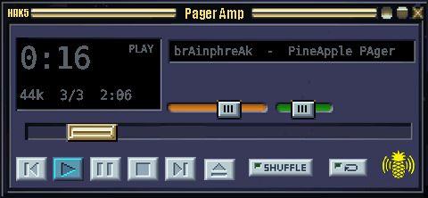
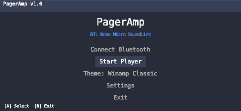
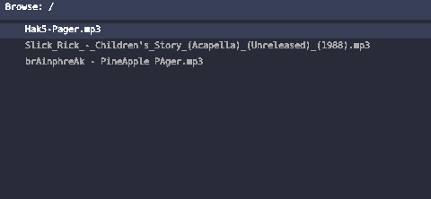
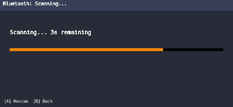
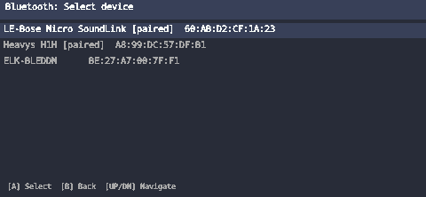
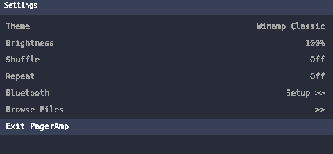
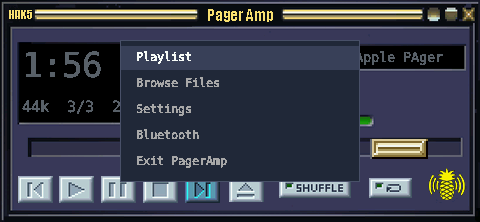
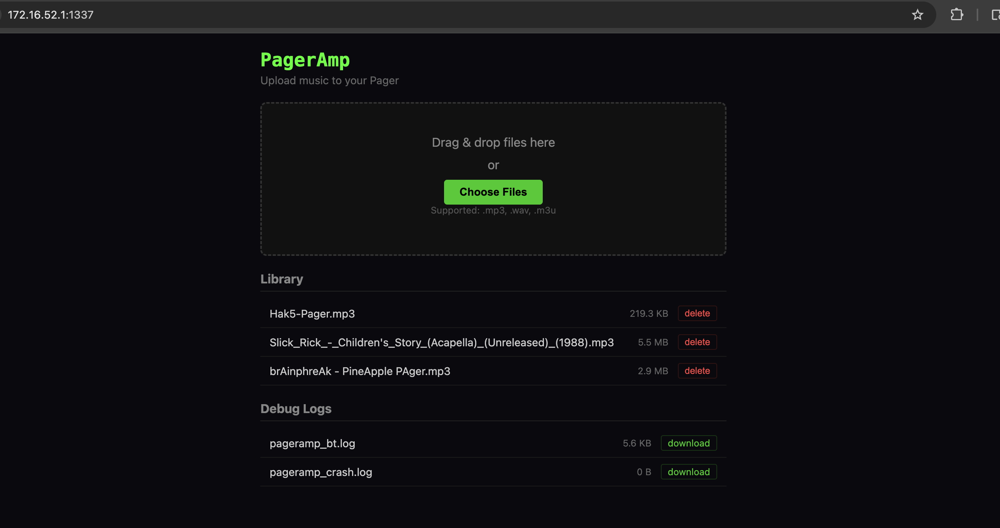

# PagerAmp

A Winamp-inspired Bluetooth music player for the [WiFi Pineapple Pager](https://shop.hak5.org/products/wifi-pineapple-pager) by Hak5.



## Features

- MP3/WAV playback via Bluetooth A2DP (speaker/headphones)
- Skinnable Winamp-style UI (classic skin included, easily customizable)
- Web upload interface at `http://172.16.52.1:1337` for adding music from your phone/laptop
- Debug log download from the web interface for troubleshooting
- Playlist management with shuffle and repeat modes
- Bluetooth device pairing and management from the on-screen menu
- Auto-reconnect to previously paired Bluetooth devices
- Auto-dim screen after 2 minutes of inactivity
- Adjustable screen brightness from settings
- Low CPU usage (~5%) using mpg123 as the audio backend

## Requirements

- WiFi Pineapple Pager (PAGERCTL library is bundled in `lib/`)
- External USB Bluetooth adapter (CSR8510 or RTL8761B recommended — the built-in MT7961 has a broken ACL data path)
- Internet connection for first-run dependency installation (python3, mpg123)

## Installation

1. SSH into the Pager and create the payload directory:

```bash
ssh root@172.16.52.1
mkdir -p /root/payloads/user/utilities/pageramp
```

2. Copy the payload files to the Pager:

```bash
scp -r root/payloads/user/utilities/pageramp/* root@172.16.52.1:/root/payloads/user/utilities/pageramp/
```

3. On the Pager, the payload will appear in the utilities menu. On first launch, it will prompt to install dependencies (python3 and mpg123) — press GREEN to install.


4. Plug in a USB Bluetooth adapter and pair your speaker from the Bluetooth menu.

## Usage

### Controls

**Now Playing Screen:**

The Now Playing screen has four focus areas you navigate between with UP/DOWN:

| Focus Area | LEFT / RIGHT | GREEN | RED |
|------------|-------------|-------|-----|
| Transport | Select button (prev/play/pause/stop/next) | Execute action | Open menu |
| Seek | Seek backward/forward 10s | — | Back to transport |
| Volume | Decrease/increase volume | — | Back to transport |
| Balance | Pan left/right | — | Back to transport |

**Menu / List Screens:**

| Button | Action |
|--------|--------|
| UP / DOWN | Navigate items |
| GREEN | Select / confirm |
| RED | Back |

### Screens

- **Now Playing** — Current track, seek bar, volume, balance, transport controls


- **Start Menu** — Launch screen with quick access to all features



- **File Browser** — Browse music directory and load songs



- **Bluetooth** — Scan, pair, and connect Bluetooth audio devices




- **Settings** — Skin selection, brightness, shuffle, repeat



- **Menu Overlay** — Quick access menu over the now playing screen



### Adding Music

**Via Web Upload:** With PagerAmp running, go to `http://172.16.52.1:1337` from any device on the Pager's network. Drag and drop MP3/WAV files to upload. You can also download debug logs from this page.



**Via SCP:** Copy files directly to the music directory:
```bash
scp your_song.mp3 root@172.16.52.1:/mmc/root/payloads/user/utilities/pageramp/music/
```

New files appear when you open the File Browser screen.

## Known Issues

- **Bluetooth disconnect between tracks with mixed sample rates:** If your music library contains MP3 files with different sample rates (e.g., 44100 Hz and 48000 Hz), the speaker may briefly announce "disconnected" when switching between them. This is because the ALSA audio device must be reopened with new parameters when the sample rate changes. To avoid this, ensure all MP3 files use the same sample rate (44100 Hz recommended). You can re-encode with: `ffmpeg -i input.mp3 -ar 44100 -b:a 192k output.mp3`

## Bluetooth Setup

The built-in MediaTek MT7961 Bluetooth on the Pineapple Pager has a firmware bug that prevents audio streaming (ACL data path is broken). You need an external USB Bluetooth adapter:

- **CSR8510** — Works out of the box
- **RTL8761B** — Firmware files are bundled in `firmware/rtl_bt/`

Plug in the adapter before launching PagerAmp. The payload automatically detects the external adapter and skips the built-in MT7961. On launch, PagerAmp bootstraps the full Bluetooth stack (dbus, bluetoothd, bluealsad) and auto-connects to the last paired device.

## Architecture

PagerAmp uses **mpg123** in remote mode (`--remote`) as the audio backend, sending decoded audio directly to a Bluetooth speaker via **BlueALSA**. The Python UI communicates with mpg123 through stdin/stdout — no FIFOs or custom daemons needed.

```
┌─────────────┐    stdin     ┌────────┐    ALSA     ┌───────────┐    A2DP    ┌─────────┐
│ pageramp.py │ ──────────── │ mpg123 │ ──────────── │ bluealsad │ ────────── │ Speaker │
│   (GUI)     │   commands   │  (-R)  │   PCM data  │ (BlueALSA)│  Bluetooth │         │
└─────────────┘    stdout    └────────┘             └───────────┘           └─────────┘
                   status
```

## Creating Themes

Themes are self-contained folders under `skins/`. To create a new theme:

1. Copy the `skins/classic/` folder:
```bash
cp -r skins/classic skins/mytheme
```

2. Edit the JSON config (`mytheme/*.json`):

| Section | What it controls |
|---------|-----------------|
| `name` | Theme name shown in the Settings menu |
| `background` | Background image filename (480x222 PNG) |
| `colors` | All UI colors as hex values (`#RRGGBB`) |
| `fonts` | Font sizes for each UI element |
| `layout` | X/Y positions and dimensions of all widgets |
| `sprites` | Filenames and positions of button/knob/toggle images |

3. Replace the image assets:

| Asset | Description |
|-------|-------------|
| `*_bg.png` | Full 480x222 background image |
| `previous-active.png`, `play-active.png`, `pause-active.png`, `stop-active.png`, `next-active.png`, `eject-active.png` | Transport button highlight sprites |
| `slider-knob.png`, `slider-knob-active.png` | Seek bar knob (normal and focused) |
| `vol-knob.png`, `vol-knob-active.png` | Volume/balance knob (normal and focused) |
| `shuffle-active.png`, `shuffle-toggled.png`, `shuffle-active-toggled.png` | Shuffle button states |
| `repeat-active.png`, `repeat-toggled.png`, `repeat-active-toggled.png` | Repeat button states |

The theme will automatically appear in the Theme selector. The screen resolution is **480x222** (landscape).

## Project Structure

```
pageramp/                    # Payload: /root/payloads/user/utilities/pageramp/
├── payload.sh               # Entry point (bash launcher)
├── pageramp.py              # Main Python application
├── player/
│   ├── client.py            # mpg123 remote-mode client
│   └── playlist.py          # Playlist manager
├── ui/
│   ├── screens.py           # UI screens (now playing, playlist, file browser, etc.)
│   ├── widgets.py           # UI widgets (buttons, sliders, lists)
│   ├── bluetooth.py         # Bluetooth pairing/connection screen
│   └── skin.py              # Skin/theme loader
├── web/
│   ├── upload_server.py     # HTTP upload server (port 1337)
│   └── templates/           # HTML templates
├── bin/
│   ├── bluealsad            # BlueALSA daemon (MIPS binary)
│   ├── mpg123               # MP3 decoder/player (MIPS binary)
│   └── aplay                # ALSA audio player (MIPS binary)
├── bt/lib/                  # BlueALSA + ALSA shared libraries
├── lib/                     # pagerctl library (libpagerctl.so + pagerctl.py)
├── config/                  # ALSA and D-Bus configuration
├── skins/                   # Theme folders
│   └── classic/             # Winamp Classic theme
│       ├── classic.json     # Theme config (colors, fonts, layout, sprites)
│       ├── classic_bg.png   # 480x222 background image
│       ├── play-active.png  # Transport button sprites
│       ├── slider-knob.png  # Seek/volume knob sprites
│       └── ...              # All other theme assets
├── fonts/                   # DejaVuSansMono.ttf
├── firmware/rtl_bt/         # RTL8761B Bluetooth firmware
├── data/                    # Runtime data (settings.json, created at runtime)
└── music/                   # Bundled demo tracks
```

Music files are stored at `/mmc/root/payloads/user/utilities/pageramp/music/` on the Pager's persistent MMC storage.

## Author

**brAinphreAk**

## License

MIT
